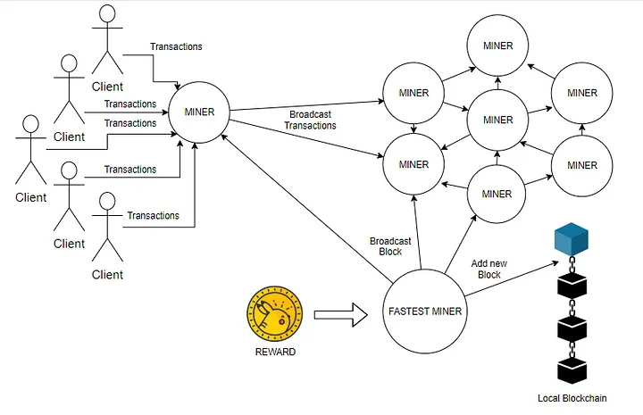

# Implémentation de la blockchain et de la crypto-monnaie avec l'algorithme de consensus PoW

## Proof of Work
La preuve de travail ( PoW ) est un algorithme de consensus blockchain, appliqué par Satoshi Nakamoto en 2009. Il a d'abord été utilisé par Bitcoin puis adopté par Ethereum.

Afin d'ajouter de nouveaux blocs à la blockchain, un algorithme est nécessaire pour décider quel mineur a la possibilité d'ajouter un bloc à la blockchain. C'est donc l'objectif principal de PoW.

## Fonctionnement
Dans PoW, les mineurs doivent investir une grande quantité de puissance de calcul afin de trouver une chaîne de hachage qui correspond à un ensemble donné de contraintes. Dans Bitcoin, les mineurs sont tenus de trouver un hachage tel qu'il y ait un certain nombre connu de zéros non significatifs au début du hachage. Un mineur trouve en permanence de nouvelles valeurs de hachage d'un bloc en modifiant un nombre, qui est haché avec le bloc, appelé nonce. Le nombre initial de zéros dans la valeur de hachage est appelé la difficulté. C'est la difficulté qui est attribuée à ces longs délais de génération de blocs.

Considérez cet exemple simple :

```js
let block = {"random":"data"};
let nonce = 1;
let difficulty = 5;
let blockHash = hash( block,nonce,difficulty );
//blockHash = 6B86B273FF34FCE19D6B804EFF5A3F5747ADA4EAA22F1D49C01E52DDB7875B4B
```

Étant donné que le blockHash ne respecte pas les contraintes, le mineur incrémentera le nonce et réessayera. Le mineur doit le faire jusqu'à ce qu'il reçoive quelque chose comme ceci :

```js
00000273FF34FCE19D6B804EFF5A3F5747ADA4EAA22F1D49C01E52DDB7875B4B
```

De plus, ce n'est pas seulement un mineur mais chaque mineur du réseau exécute le même algorithme sur le même bloc. Cela crée un environnement concurrentiel où chaque mineur est en concurrence avec les autres. Le premier mineur qui trouve une valeur de hachage qui satisfait les contraintes données remporte la manche et devient le leader de la manche. Il ajoute ensuite le bloc après l'avoir signé avec sa clé privée et le diffuse sur le réseau. Les autres mineurs ajoutent le bloc reçu dans leurs chaînes locales.

Pour effectuer une tâche aussi coûteuse en calcul, le mineur reçoit une incitation. Dans le cas du bitcoin, les mineurs reçoivent une certaine quantité de bitcoin et les frais de transaction de toutes les transactions présentes dans le bloc qu'ils viennent d'ajouter à la blockchain.

## Advantages

> Ses principaux avantages - la protection contre les attaques Ddos et l'influence des faibles fractions de crypto-monnaies détenues par le mineur dans la capacité d'extraction.

Étant donné que PoW est si coûteux en calcul, une attaque efficace nécessite également une puissance de traitement similaire. Concurrencer l'ensemble du réseau est financièrement irréalisable pour un attaquant. Un attaquant serait progressivement à court d'argent pour financer sa propre attaque.

## Désavantages

Un inconvénient majeur du PoW est également son avantage. Le coût énorme de l'exécution de cet algorithme. Pour se rendre compte de la quantité d'énergie consommée, lisez [l'article](https://powercompare.co.uk/blog/estimated-electricity-cost-of-mining-one-bitcoin-by-country/) de comparaison de puissance qui élabore ce problème.

> L'exploitation minière de Bitcoin utilise désormais plus d'électricité que 159 pays individuels

Deuxièmement, le bitcoin n'est pas complètement sécurisé et PoW n'est pas une panacée à toutes les attaques. L'attaque à 51 % est un scénario dans lequel un attaquant peut obtenir une puissance de calcul suffisante supérieure à 51 % de l'ensemble du réseau, puis l'attaquant peut réussir à altérer la blockchain.

## Structure

Comprenons la structure de l'algorithme PoW à travers ces diagrammes :

